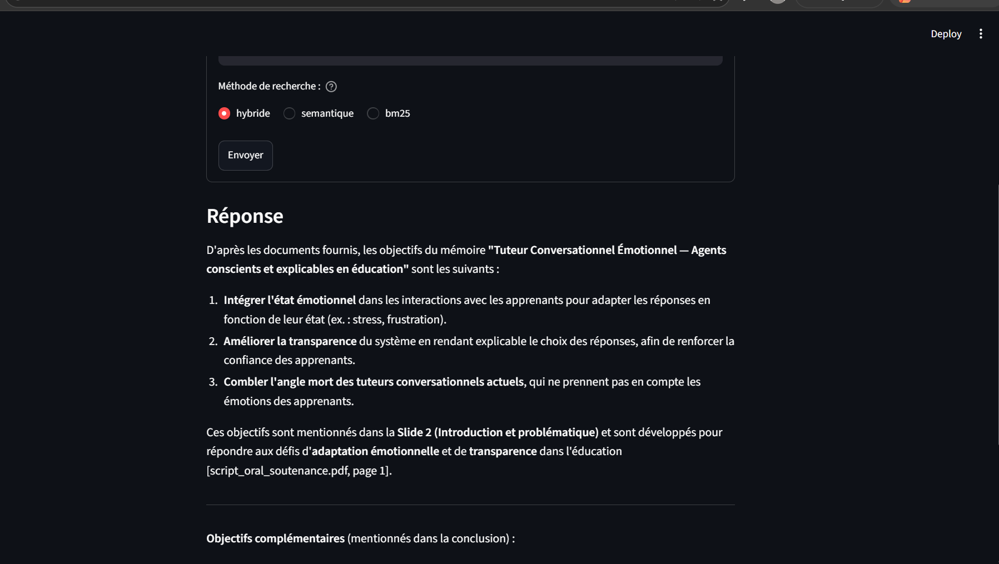

# Multilingual RAG Assistant with Mistral

A small web app that answers questions about your PDF documents, in **French, English or Arabic**, using the Mistral API. Answers cite their sources (file + page).



## How it works
1. **Read** PDF files and split them into overlapping chunks
2. **Embed** each chunk with `mistral-embed`
3. **Retrieve** the most relevant chunks for a question, with 3 methods:
   - **semantic** search (cosine similarity between embeddings)
   - **keyword** search (BM25, implemented from scratch)
   - **hybrid** search (normalized combination of both)
4. **Generate** an answer with `ministral-8b-latest`, grounded in the retrieved passages

## Evaluation
`eval.py` measures retrieval quality on a set of test questions (in French, English and Arabic) for which the correct page is known. It reports the **hit@k** score (is the correct page among the k retrieved passages?) for each search method.

```bash
python eval.py my_document.pdf
```

## Engineering details
- Handles API rate limits (HTTP 429) with throttling between calls and retries with exponential backoff
- Questions are only sent on click, and repeated questions are cached, to avoid unnecessary API calls
- The API key is read from an environment variable and never stored in the code

## Tech
Python, Mistral API, NumPy, pypdf, Streamlit

## Run it
```bash
pip install -r requirements.txt
export MISTRAL_API_KEY="your_key"          # Windows PowerShell: $env:MISTRAL_API_KEY="your_key"
streamlit run app.py
```

## Next steps
- Evaluate answer quality (not only retrieval)
- Online demo (Streamlit Community Cloud)
